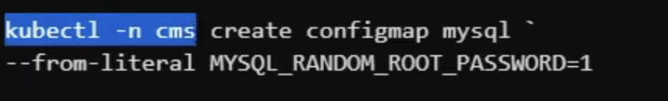
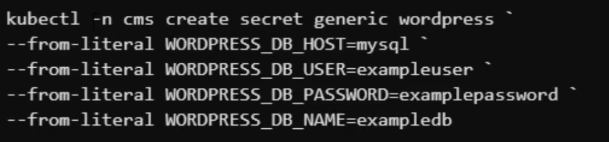
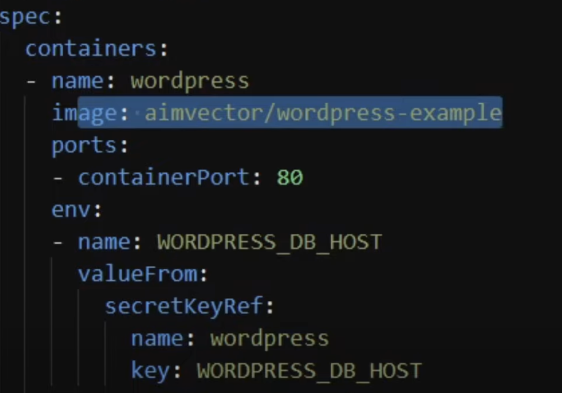
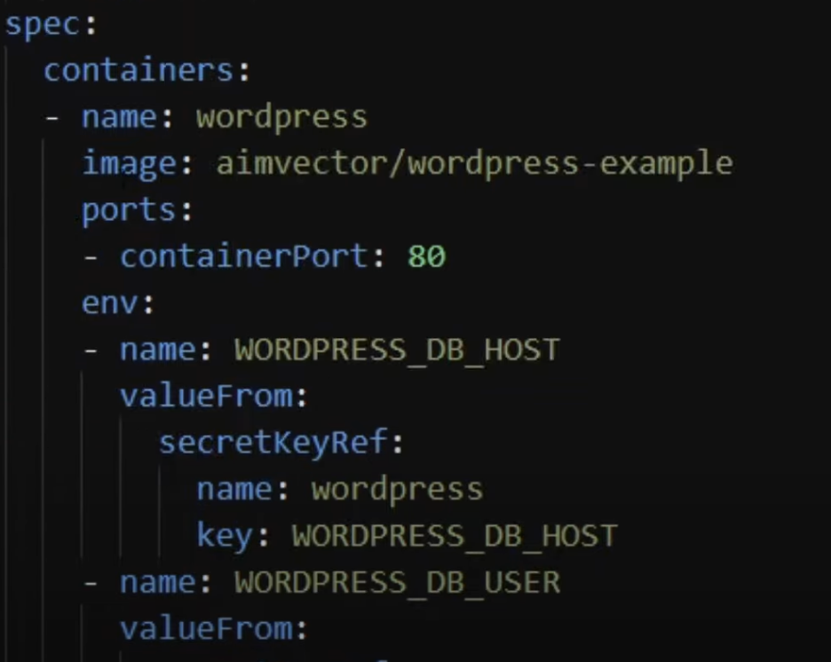
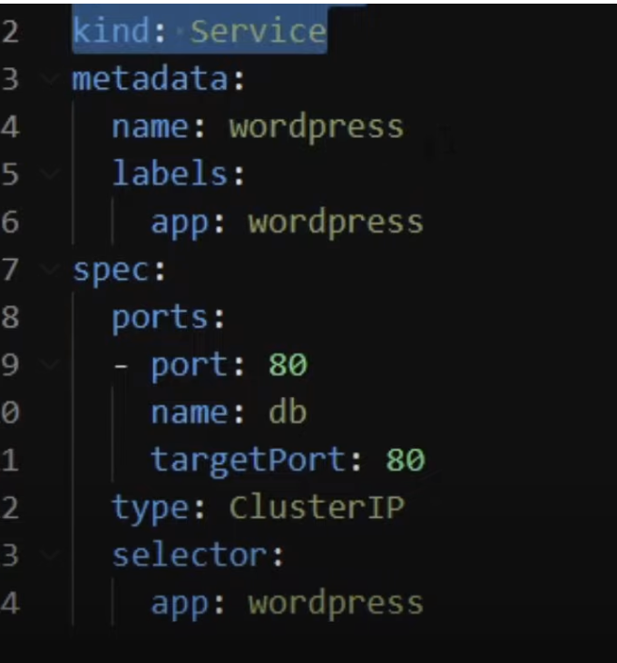

kubernetes uses yaml files to create infrastructure

--OVERVIEW--

use KIND for local testing, this is Kubernetes In Docker

creating a single cluster with kind (starts cluster in docker container):
`kind create cluster --image kindest/node:v1.23.5`

see the running nodes :
`kubectl get nodes`

--NAMESPACES--

conceptually compartmentalise your resources into virtual clusters, that way you can allocate a set amount of resource to each namespace. can set namespace for employee type, department, products etc.

create namespace:
`kubectl create namespace <namespace name>`

see all namespaces:
`kubectl get ns`

once our namespace has been created we can go ahead and add all our resources, including things such as config maps and secrets

--CONFIGMAPS--

ConfigMaps is an object used to store non-confidential data in key value pairs, pods can consume configMaps as env variables, command line args or as config files in a volume.
The advantage of configMaps is that it allows you to decouple environmnet specific configurations from your applications, making the app easily portable.

creating configmaps that pass key value pairs:
`kubectl -n <namespace name> create configmap <configmap name> --from-literal ENV_VAR_NAME=value`
e.g:

list out configmaps:
`kubectl -n <namespace name> get cm`

output configmap in yaml format:
`kubectl -n <namespace name> get cm <configmap name> -o yaml`

--SECRETS--
work similar to configmaps but are encrypted at rest.
It's important to keep secrets and config maps separate as we can use RBAC to give access to secrets to some people but others can only see configMaps

creating secrets:
`kubectl -n <namespace name> create secret generic <secret name> --from-literal SECRET_KEY=secretValue`

in the picture below we can see how the secret value is set as an environment variable in the deployment yaml:

list all secrets:
`kubectl -n <namespace name> get secret`

--DEPLOYMENTS--

Use kubernetes deployment to define how we want kubernetes to run the containers, we do this through the spec in the yaml file.

in the deployments yaml file you can state pods and number of replicas (more pods to allow failover)

in yaml file you set kind: Deployment for deployment files,
can set instance number under replicas in spec area

in the spec you also define the containers you want to run with:
name, image, ports, you can also add env variables and pass in secret values that you have stored already:

the env variables can also be mapped to configmaps

deploy application to k8s:
kubectl -n <namespace name> apply -f <deploy.yaml file>

once the deployment happens you can view the pods:
`kubectl -n <namespace name> get pods`

--SERVICES--

Once we expose a port through our deployment yaml, we need to send traffic to that port, to do this we use services.

A service is a construct that defines how we want traffic to flow to our pods. It is an abstract way to expose an application running on a set of pods as a network service. You can define a service with service.yaml file:

In the image above, the targetPort needs to match the port of the selector. The selector also needs to be the same name as the label for the app that you have set in the deployment.yaml file.

difference between port and target port:
the target port is what the service is exposing and listening for external traffic. Once it receives traffic, it then forwards it to the port, which is the port that the pods inside the cluster are listening on.

port is the port on which the Service itself listens for traffic, while targetPort is the port to which traffic is forwarded to the backend Pods. They are separate because the Service may expose a different port to clients than what the Pods are listening on internally. This abstraction allows for flexibility in managing networking and port assignments within Kubernetes deployments.

Services can provide a public or private endpoint.
